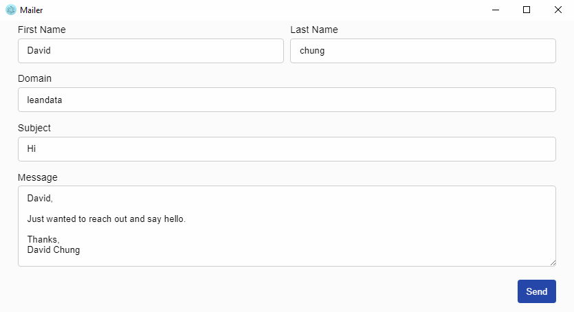

# Mailer &middot; [](https://github.com/davidc4747/mailer) [](https://github.com/davidc4747/mailer/pulls)

Guesses emails like crazy

## Screenshots


   

## Installation

```shell
git clone https://github.com/davidc4747/mailer.git
cd mailer/
npm i
npm run pack

# A package of the project will be created inside the "package/" folder
# An executable file for your operating system will be inside

```

## Developing

### Built With
HTML & CSS  
JavaScript  
Electron  
ReactJS  
nodemailer  

### Prerequisites
What is needed to set up the dev environment:  
[Node.js](https://nodejs.org/en/)  
[Git](https://git-scm.com/)  


### Setting up Dev

Here's a brief intro about what a developer must do in order to start developing
the project further:

```shell
git clone https://github.com/davidc4747/mailer.git
cd mailer/
npm i
npm start
```

### Building

If your project needs some additional steps for the developer to build the
project after some code changes, state them here. for example:

```shell
git clone https://github.com/davidc4747/mailer.git
cd mailer/
npm i
npm run build
```

### Deploying / Publishing

How to Deploying: 

```shell
# TODO
```

## Configuration

You need to create a "transporter.config.json" next to the package.json.  
Example transporter.config.json:  

```shell
{
	"service": "Gmail",
	"auth": {
		"user": "example@email.com",
		"pass": "EXAMPLE_KEY"
	}
}
```
